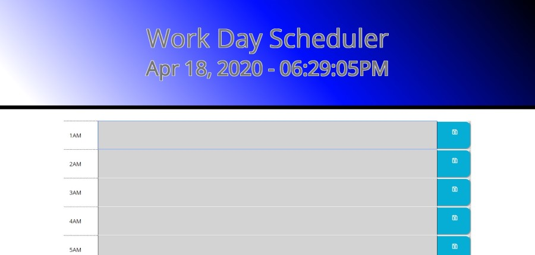
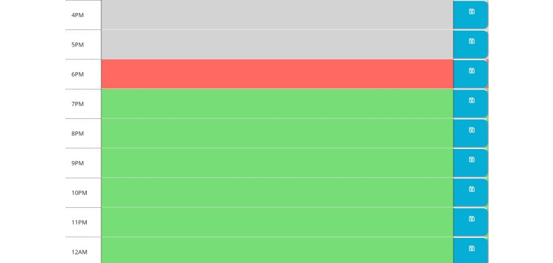

<h1 align="center">Work Day Scheduler</h1>

    
    
    
    

   

    
    

  

## Table of Contents
- [Description](#description)
- [Installation](#install)
- [Usage](#usage)
- [Questions](#questions)

## Description
This is a work day planner. It has a working clock at the top that stays updated to the second. 
There are slots for all 24 hours in the day cause you never know what schedule a person leads. The hours
of the day will turn gray once passed, red when present, and green when upcoming. 

Data is saved to localStorage and should be present upon refresh.  
  
## Install
Clone repo to your text editor

## Usage

Simply open index.html in your default browser

## Below is a link to the GitHub repository   
[Work Day Scheduler Github](https://github.com/mattkohl82/work-day-scheduler)    

### Deployed app 
[Work Day Scheduler](https://mattkohl82.github.io/work-day-scheduler/) 

## Questions
#### [Mattkohl82 for GitHub](https://github.com/Mattkohl82) 
#### mattkohl82@gmail.com for ✉️ email 