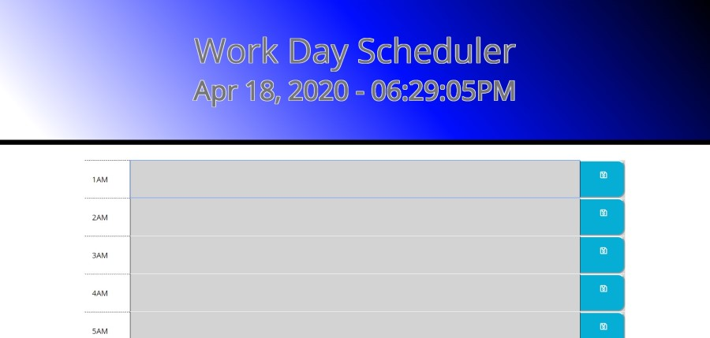

#Work Day Scheduler

Working link to site 

https://mattkohl82.github.io/work-day-scheduler/

Link to github page

https://github.com/mattkohl82/work-day-scheduler

This is a work day planner. It has a working clock at the top that stays updated to the second. 
There are slots for all 24 hours in the day cause you never know what schedule a person leads. The hours
of the day will turn gray once passed, red when present, and green when upcoming. 

Data is saved to localStorage and should be present upon refresh. 

